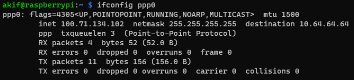

# FINAL REPORT

## Table of Contents

1. [Explanation of Library](#explanation-of-library)
2. [ECM (Ethernet Control Modem) Protocol ](#ecm-ethernet-control-modem-protocol)
3. [Point to Point Protocol (PPP) ](#point-to-point-protocol-ppp)
4. [Qualcomm MSM Interface (QMI) ](#qualcomm-msm-interface-qmi)
5. [Comparison of ECM-PPP-QMI ](#comparison-of-ecm-ppp-qmi)
6. [Conclusion ](#conclusion)

## Explanation of Library

* I divided my library into 3 different classes: **Communicate**, **HTTP_COMM** and **MQTT_COMM**.

### Communicate Class

* The **Communicate** class is where the first connection is established and contains the basic AT commands. The first connection is created by the **Communicate** class and assigned to an object named **"device "**. This object will be used by other classes to access the connection and the methods in the **Communicate** class. 
    ``` python
    device = serial_comm.Communicate("/dev/ttyUSB2", timeout=5)
    http_comm = serial_comm.HTTP_COMM(device)
    mqtt_comm = serial_comm.MQTT_COMM(device)
    ```
* Communicate class consists of 7 methods. These methods are `__init__()`, `configure_serial()`, `send_at_command()`, `get_at_command()`, `is_open()`, `print_result()` and `close()`.
    * The **`__init__()`** method is a constructor method that takes as input the necessary settings for the connection to be established, and successfully establishes the connection if the information is correct. 
        ``` python
        device = serial_comm.Communicate("/dev/ttyUSB2", timeout=5)
        ```
    * The **``configure_serial()`** method is a method that allows you to change the parameters of the connection after the connection is established and reconnect it. If the wrong parameter is entered, the connection is terminated. An error due to an incorrect parameter is printed to the console. 
        ``` python
        device.configure_serial(baudrate=5600)
        ```
        
    * The **`send_at_command()`** method is a method that can send AT commands over a serial connection. It prints an error message if the AT command could not be sent or if the connection is closed. 
    * The **`get_at_command()`** method takes the response from the serial connection after an AT command has been sent and splits the response by line breaks (***\n***). It stores each line in a directory. By sending this directory to the `print_result()` method, the incoming command is properly displayed on the console. It also returns the last element in this directory as an answer. The following code is taken from the method.
        ``` python
        response = self.serial.read_all().decode()
        rspn = response.split("\n")
        self.print_result(rspn)
        return rspn[len(rspn) - 2]
        ```
    * The **`is_open()`**  method is a method that checks if the serial port is open. It returns True if it is open and False otherwise.
    * The **`print_result()`** method is a method to print the response to an AT command to the screen in an organized way. It shows the details of the AT command and the response.
    * The **`close()`** method closes the serial communication. It prints a message when closing the connection.

        ``` python
        device.send_at_command("AT")
        device.get_at_command()
        device.close()
        ```
        

### HTTP_COMM Class

* The **HTTP_COMM** class provides an interface containing the AT commands necessary to communicate data over **HTTP**. This class takes a **Communicate** object, sends AT commands over serial communication and processes the responses.

* HTTP_COMM class consists of 7 methods. These methods are called `__init__()`, `prep_for_HTTP()`, `get_data_HTTP()`, `post_data_HTTP()` and `read_data_HTTP()`.
    * The **`__init__()`** method is a constructor method that takes a **Communication** object named **comm** as input so that the HTTP_COMM class can use the methods in the Communicate class. When calling methods in the **Communication** class, **comm** must be added before the method you want to use. Example code is shown below. 
        ``` python
        def __init__(self, comm):
            self.comm = comm

        def read_data_HTTP(self):
            .....
            response = self.comm.serial.read_all().decode()
            .....
        ```
    * The **`prep_for_HTTP()`** method is a method to set the common preconnection settings required when implementing the HTTP GET and POST methods. The AT commands to be executed are stored in a directory. The methods in this directory are called one after the other. However, the **"AT+QIACT? "** command checks whether the connection has been established. If the connection has already been established, it gets an answer starting with **+QIACT:** and returns an IP address with this answer. **So time is saved by skipping the following commands, i.e. the steps to establish the connection.** Finally, if it receives an error while executing the commands, it catches it and prints it to the console to stop the execution. If no error is received, a successful completion message is printed to the console.
        ``` python
        def prep_for_HTTP(self):
            preps = [
                "AT",
                "AT+QHTTPCFG= \"contextid\",1",
                "AT+QHTTPCFG= \"responseheader\",1",
                "AT+QIACT?",
                "AT+QICSGP=1,1,\"de1.super\",\"\",\"\",1",
                "AT+QIACT=1"
            ]

            for prep in preps:
                self.comm.send_at_command(prep)
                time.sleep(0.5)
                response = self.comm.serial.read_all().decode()

                rspn = response.split("\n")
                self.comm.print_result(rspn)

                if ("+QIACT:" in rspn[1]):
                    print("!!!!!!!! Preperations for HTTP is COMPLETED !!!!!!!!\n")
                    return None
                if (rspn[len(rspn) - 2].strip() == 'ERROR'):
                    print("Program gives error.\n")
                    return None

            print("!!!!!!!! Preperations for HTTP is COMPLETED !!!!!!!!\n")

        ```
    * The **`get_data_HTTP()`** method is a method that provides an HTTP GET request with AT commands over the specified URL. This method first calls the `prep_for_HTTP()` function I wrote to prepare the connection. After the connection is successfully established, the byte length of the URL we receive as input is calculated. This calculation is kept for the **"AT+QHTTPURL={byte_length},80"** command to be used later. The commands required for the HTTP GET request are stored in the directory. This directory is called in order. After the **"AT+QHTTPURL={byte_length},80"** command in the directory, **CONNECT** is output and asks us to enter the length of the input. In order to send this input, the received responses go through a checking mechanism. If the output contains **CONNECT**, the URL is entered. If an error is received, this error output is printed to the console and the program terminates. After a successful HTTP GET request, the `read_data_HTTP()` function is called to read the request. If no error is received during reading, the method reports that it ran successfully.
        ``` python
        def get_data_HTTP(self, url):
            self.prep_for_HTTP()

            byte_length = len(url.encode('utf-8'))

            commands = [
                "AT+QIACT?",
                f"AT+QHTTPURL={byte_length},80",
                "AT+QHTTPGET=80"
            ]

            for command in commands:
                self.comm.send_at_command(command)
                result = self.comm.get_at_command().strip()
                if (result == 'CONNECT'):
                    time.sleep(1)
                    self.comm.send_at_command(url)
                    time.sleep(1) 
                if (result == 'ERROR'):
                    print("Program gives error.\n")
                    return None
            time.sleep(1)

            rspn = self.read_data_HTTP()
            if ("ERROR" in rspn[len(rspn)-2]):
                print("Program gives error.\n")
                return None
            else:
                print("!!!!!!!! HTTP GET : SUCCESS !!!!!!!!\n")
        ```
    * The **`post_data_HTTP()`** method is a method similar to an HTTP GET request, passing the data entered by the user on the specified URL. If the user doesn't enter any data, a default message is passed. In general terms, it is similar to the `get_data_HTTP()` method. However, there are a few distinct differences. First of all, the **"Message: "** structure is added to the beginning of the data received from the user in order to let the server know that the data to be sent is going as a message. Secondly, the **CONNECT**, the output of waiting to receive input from the user, which I mentioned in the previous method, comes twice in the HTTP POST method. This is because we are expected to make two inputs. These are the URL and the data entered by the user. **With a control mechanism, I prevented them from interfering with each other and ensured that the correct commands work.** After the HTTP POST request was successfully provided, I ran the `read_data_HTTP()` method so that it can be read by the user. After the reading process is completed successfully, the method reports that it has run successfully.
        ``` python
        def post_data_HTTP(self, url, data="Default Message"):
            data = "Message=" + data
            self.prep_for_HTTP()

            byte_length = len(url.encode('utf-8'))
            data_length = len(data.encode('utf-8'))

            commands = [
                "AT+QIACT?",
                f"AT+QHTTPURL={byte_length},80",
                f"AT+QHTTPPOST={data_length},80,80"
            ]

            for command in commands:
                self.comm.send_at_command(command)
                result = self.comm.get_at_command().strip()
                if (result == 'CONNECT'):
                    if ("URL" in command):
                        print("Entering URL")
                        time.sleep(1)
                        self.comm.send_at_command(url)
                        time.sleep(1)
                        self.comm.get_at_command().strip()
                    elif ("POST" in command):
                        print("Entering Data")
                        time.sleep(1)
                        self.comm.send_at_command(data)
                        time.sleep(1)
                        self.comm.get_at_command().strip()
                if (result == 'ERROR'):
                    print("Program gives error.\n")
                    return None
            time.sleep(1)
            
            rspn = self.read_data_HTTP()
            if ("ERROR" in rspn[len(rspn)-2]):
                print("Program gives error.\n")
                return None
            else:
                print("!!!!!!!! HTTP GET : SUCCESS !!!!!!!!\n")
        ```
    * The **`read_data_HTTP()`** method is a method that sends an AT command to read data over HTTP. A read request is sent using the **AT+QHTTPREAD=80** command. If there is data to be read, it receives it and stores it in a directory and prints this directory to the console. 
        ``` python
        def read_data_HTTP(self):
            print("\n !!!!!! READING DATA !!!!!!\n\n")
            self.comm.send_at_command("AT+QHTTPREAD=80")
            time.sleep(2)
            response = self.comm.serial.read_all().decode()
            rspn = response.split("\n") 
            for i in range(1, len(rspn) - 1):
                print(f" {rspn[i]}\n")
            return rspn
        ```

### MQTT_COMM Class

* The **MQTT_COMM** class is a class that encapsulates **MQTT** communication functionality via AT commands. This class takes a **Communicate** object, sends AT commands over serial communication and processes the responses. 
* The MQTT_COMM class consists of 2 methods. These methods are `__init__()` and `communicate_MQTT()`. 
    * **`__init__()`** method is a constructor method that takes a Communication object named **comm** as input so that the **MQTT_COMM** class can use the methods in the **Communicate** class, as in the previous class.
    * The **`communicate_MQTT()`** method is the method that makes the MQTT protocol work successfully. It maintains a directory of AT commands that should be used in MQTT communication and calls them in order. It connects to HIVEMQ, a free MQTT broker. If **"RECV "** is detected in the response, it indicates successful message reception. If **"ERROR "** is encountered, the program prints an error message, and if the response contains **"QMTSTAT: 0,1"**, it indicates an error.
        ``` python
        def communicate_MQTT(self, data="Default Message"):
            data_length = len(data.encode('utf-8'))
            commands = [
                "AT",
                "AT+QMTOPEN=0,\"broker.hivemq.com\",1883",
                "AT+QMTCONN=0,\"Communicate\"",
                "AT+QMTSUB=0,1,\"topic/pub\",0",
                f"AT+QMTPUBEX=0,0,0,0,\"topic/pub\",{data_length}",
                data, 
                "AT+QMTDISC=0"
            ]

            for command in commands:
                self.comm.send_at_command(command)
                response = self.comm.get_at_command().strip()
                if ("RECV" in response):
                    print("!!!!!! Message succesfully recieved. !!!!!!")
                    time.sleep(2)
                if (response == 'ERROR'):
                    print("Program gives error.\n")
                    return None
                elif ("QMTSTAT: 0,1" in response):
                    print("Program gives error.\n")
                    return None
        ```

## ECM (Ethernet Control Modem) Protocol 

* ECM (Ethernet Control Model) is a network protocol that allows a device to communicate with another device over USB. ECM protocol works to establish the network connection, transmit IP packets and make it possible for raspberry pi to access the internet over cellular network. 
* ECM Protocol installations are specified step by step. Reference [sixfab ecm installation site](https://docs.sixfab.com/page/cellular-internet-connection-in-ecm-mode) for installation. 
    * First of all, the driver options of the USB points were checked by entering the `lsusb -t` command in the terminal. This is the only operation I will do in the terminal for installation in this protocol. 
        
    * After running the commands `AT+CGDCONT=1, "IP", "de1.super"`, `AT+QCFG="usbnet",1` and `AT+CFUN=1,1` from the library I am developing, I reset the modem and make it ready for internet connection. 
* ECM Protocol test steps are given below. 
    * I control the connection with `ifconfig usb0` command. 
        
    * I tested my connection with the `ping` command.

          
    * I did a universal speed test using `speedtest`. **Download: 33.64 Mbit/s**, **Upload: 5.05 Mbit/s**
        

## Point to Point Protocol (PPP) 

* Point-to-Point Protocol (PPP) is a network protocol used to communicate between computers over serial links. PPP is easy to set up, is a widely used protocol and is flexible to devices. 
* Reference [sixfab ppp installation site](https://docs.sixfab.com/page/setting-up-the-ppp-connection-for-sixfab-shield-hat) for PPP protocol installation. 
    * The `AT+QCFG="usbnet"` command must return 0 to enable the PPP protocol. 
    * After cloning the repository on github, I started the installation process. 
        ```
        git clone https://github.com/sixfab/Sixfab_PPP_Installer.git 
        cd Sixfab_PPP_Installer 
        chmod +x ppp_install.sh
        sudo ./ppp_install.sh
        ```
    * After entering the required information (APN, username, password, PORT etc.) in the setup step, I used the `sudo pon` command to start the connection. 
* The PPP protocol test steps are given below. 
    * I checked the connection with `ifconfig ppp0` command. 
        
    * I tested my connection with the `ping` command. 
        
    * I did a universal speed test using `speedtest`. **Download: 9.65 Mbit/s**, **Upload: 10.25 Mbit/s**
        

## Qualcomm MSM Interface (QMI) 

* Qualcomm MSM Interface (QMI) is a protocol designed specifically for communicating over cellular data links. This protocol offers a more modern and customizable structure compared to previous connection protocols, which provides more flexibility in cellular data transmission and management. 
* Reference [sixfab qmi installation site](https://docs.sixfab.com/page/setting-up-a-data-connection-over-qmi-interface-using-libqmi) for QMI protocol installation. 
    * First of all, check the driver options of the USB ports by entering the `lsusb -t` command in the terminal. In this step **qmi_wwan** should appear in the driver section. 

          
    * In order to provide QMI protocol, `AT+QCFG="usbnet"` command must return 0. 
    * The following commands are entered from the terminal screen and the installation is done.
        ```
        sudo apt update && sudo apt install libqmi-utils udhcpc
        sudo qmicli -d /dev/cdc-wdm0 --dms-get-operating-mode
        sudo qmicli -d /dev/cdc-wdm0 --dms-set-operating-mode='online'
        sudo ip link set wwan0 down
        echo 'Y' | sudo tee /sys/class/net/wwan0/qmi/raw_ip
        sudo ip link set wwan0 up
        sudo qmicli -d /dev/cdc-wdm0 --wda-get-data-format
        sudo qmicli -p -d /dev/cdc-wdm0 --device-open-net='net-raw-ip|net-no-qos-header' --wds-start-network="apn='YOUR_APN',ip-type=4" --client-no-release-cid
        ```
    * As a last step before the installation phase was completed, I configured the IP address and default route with udhcpc using `sudo udhcpc -q -f -i wwan0` command. 
        
* The QMI protocol test steps are as follows.
    * I tested my connection with the `ping` command. 
        
    * I did a universal speed test using `speedtest`. **Download: 8.39 Mbit/s**, **Upload: 19.97 Mbit/s**
        


## Comparison of ECM-PPP-QMI

* ECM has a simple and direct structure and is suitable for basic internet connection via USB. PPP is more flexible, can support various network protocols and is used for various types of connections, while QMI is specifically designed to communicate with Qualcomm chip modems (EG25-G) and manage cellular connections more efficiently. According to my speed tests, QMI is faster than PPP.

## Conclusion

* By developing a library that communicates with AT commands within the scope of this project, I both increased my interest in this field and strengthened my knowledge of object-oriented programming. The 7-week process improved me significantly by giving me the opportunity to write reports and practice object-oriented programming.

* I faced many challenges and struggled with errors during library writing, but as I resolved these errors, I experienced a noticeable increase in my programming skills. Implementing real-world applications such as communicating via AT commands and transmitting data using HTTP and MQTT protocols was of great importance in terms of turning theoretical knowledge into practice. Overall, this project helped me to improve both my technical skills and my problem-solving abilities. Facing mistakes, finding solutions and learning in the process allowed me to gain significant experience in software development.
