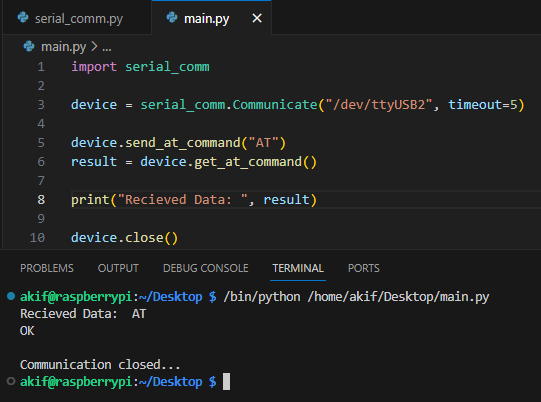
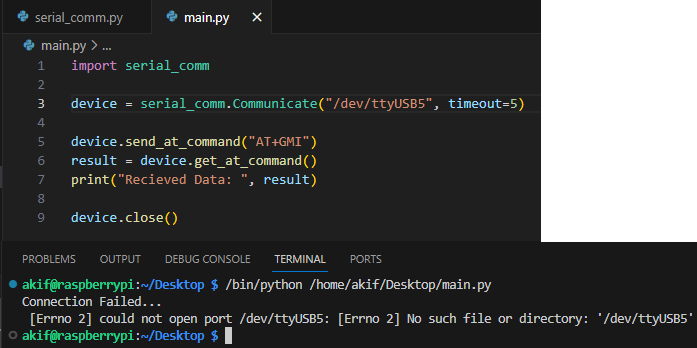
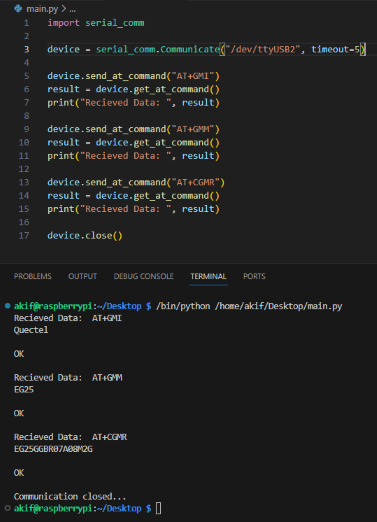
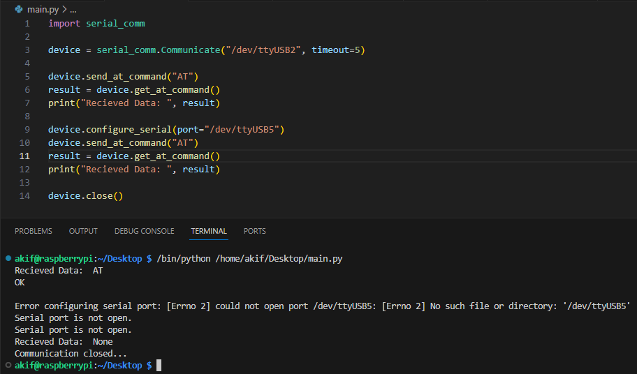
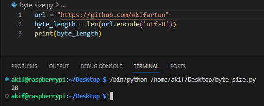

## Week 3

## Table of contents
- [Modem Operation Test with *atcom* Library](#modem-operation-test-with-atcom-library)
- [Writing a Library That Can Communicate with Modem](#writing-a-library-that-can-communicate-with-modem)
- [AT Command Tests with the Written Library](#at-command-tests-with-the-written-library)
- [Sending HTTP GET and POST requests to webhook.site via modem](#sending-http-get-and-post-requests-to-webhooksite-via-modem)

---

### Modem Operation Test with *atcom* Library

* After learning the logic of AT commands the previous week, I had a problem when I wanted to try it. After consulting my technical advisor at the weekly meeting, I realised that the problem was caused by the "modem manager" plugin. After deleting this plugin, my problem was solved and I received my first response as "OK".

### Writing a Library That Can Communicate with Modem

* Firstly, after successfully responding to the AT command from the atcom library, I investigated how to read and receive data by examining the [pySerial library](https://pyserial.readthedocs.io/en/latest/pyserial_api.html#classes).
* The library contains 6 different methods:
    * `__init__(self, port=None, baudrate=115200, parity=serial.PARITY_NONE, timeout=None)`

        * This function is the initialiser method **(constructor)** of the class. It is called when the class instance is created (object is created).

        * **port**: Specifies the name of the serial port to be used.
        * **baudrate**: Specifies the connection speed (default value: 115200).
        * **parity**: Specifies the parity check (default value: PARITY_NONE).
        * **timeout**: Specifies the timeout to be used in read operations.
        
        * This method creates the serial connection. If the connection fails, *serial.SerialException* is caught and an error message is printed and the program terminates.
    *  `is_open(self)`

        * This function checks whether the serial port is open.
        * **True** indicates that the serial port is open; **False** indicates that the serial port is closed.

    * `configure_serial(self, port=None, baudrate=None, parity=None, timeout=None)`

        * This function is used to update the settings of the serial port.

        * Closes and reopens the serial connection with the new settings specified by the **port**, **baudrate**, **parity**, and **timeout** parameters.

    * `send_at_command(self, data)`

        * This function sends the specified AT command via the serial port.

        * It receives the data to be sent, adds "\r\n" characters and sends the data via serial port.

    * `get_at_command(self)`

        * This function sends an AT command and receives the response from the serial port.

        * After waiting for a certain time with **time.sleep(2)**, it decodes all the data read over the serial port and returns the answer.

    * `close(self)`

        * This function switches off serial communication. It closes the *serial.Serial* object and prints a shutdown message.

## AT Command Tests with the Written Library

  * After the writing of the library was completed, I first made my connection using the constructor method and tried the "AT" command. After connecting successfully, I received the "OK" response.
   
    

  * Since I used debugging in the library I developed, it should not connect to the wrong port and should give a warning message. Secondly, I tested this.
    
    

  * For the next test, I tried sending multiple "AT" commands and receiving these responses in sequence without overlapping.
    
    

  * My last test was to use the *configure_serial* method to change the baudrate after the modem is connected. In this test, I wrote an invalid port, especially when making the second connection after the first connection. In this way, I found out if both the method and debugging worked.
    
    

## Sending HTTP GET and POST requests to [webhook.site](http://webhook.site) via modem 

* After writing the library that can talk to the modem, I started the first research on sending HTTP GET and POST requests with the modem, which I plan to finish next week.
* In this first research I learnt how to connect to HTTP server with AT commands and what is the command for this. I realised that I can integrate the HTTP server link with the **AT+QHTTPURL=<url_len>[,<input_time>]** command. But this command first takes the byte length of the url link to be added.
* I researched how to find the byte length of the URL link and found [in a forum](https://stackoverflow.com/questions/6387746/how-to-calculate-the-url-byte-length) that the browser's URL is standard ASCII and putting Unicode characters in the URL requires special encoding.
* **byte_length = len(url.encode('utf-8'))** I get the byte length of the url link I get using this line. I tried this code with a code whose byte length I know and it returns the correct answer.

    
