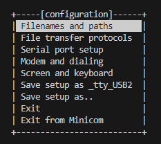
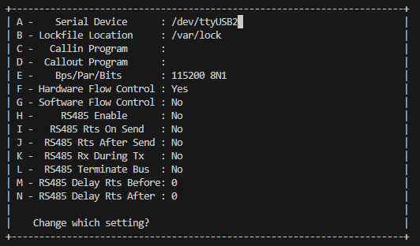
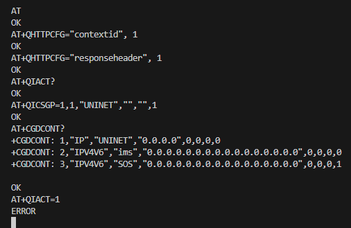

## Week 4 

### Configuration MINICOM

* While testing the HTTPS commands I found for the Quectel EG25-G, I realised that it was tedious to test the AT commands one by one with the library I wrote. Therefore, I planned to first test the AT commands on MINICOM and integrate them into my library after understanding their functions.
* I successfully downloaded it with `sudo apt-get install minicom`.
* Using `sudo minicom -s /tty/USB2` I get to the minicom configuration menu.

    
* Select **Serial port setup** from this screen and set it as shown in the picture below.

    

* After making the adjustments, when it was successful, Welcome to minicom 2.8 appeared and I started testing AT commands.

### Testing HTTPS AT commands via modem 

* When I started to search for HTTPS AT commands in QUECTEL EG25-G modem, I realised that the details of these commands are in [Quectel_LTE_Standard_HTTP(S)_Application_Note](https://www.quectel.com/download/quectel_lte_standard_https_application_note_v1-1) file. 
* When I examined this document, **AT+QHTTPCFG**, **AT+QIACT**, **AT+QICSGP**, **AT+QHTTPURL**, **AT+QHTTPGET** and **AT+QHTTPPOST** commands caught my attention. 
* I started to test whether I could make the connection successfully by trying the example in the document on my minicom.
  * Firstly, I made adjustments for the PDP content we will create. These adjustments were to set the ID and turn on the response header feature. It was performed with these commands respectively.
    * `AT+QHTTPCFG="contextid", 1`. **`OK`** returned. 
    * `AT+QHTTPCFG="responseheader", 1`. **`OK`** returned.
  * As the next step, I ran `AT+QIACT?` and got **`OK`** output. 
  * I set the parameters of the TCP/IP content with `AT+QICSGP=1,1, "UNINET",""",""",1` command. UNINET here is the APN name. It returned **`OK`**.
  * I accessed the list of data connection profiles with the `AT+CGDCONT` command.
    * **+CGDCONT: 1,"IP","UNINET","0.0.0.0",0,0,0,0**
    * **+CGDCONT: 2,"IPV4V6","ims","0.0.0.0.0.0.0.0.0.0.0.0.0.0.0.0",0,0,0,0**
    * **+CGDCONT: 3,"IPV4V6","SOS","0.0.0.0.0.0.0.0.0.0.0.0.0.0.0.0",0,0,0,1**
  * In the next step, I ran the `AT+QIACT=1` command to activate the PDP content.**Hata** verdi
  * Although I tried the solutions I could find in the Error Handling section in the [Reference Book](https://www.quectel.com/download/quectel_lte_standard_https_application_note_v1-1) and on the internet, I still could not solve this error. This slowed me down a lot.
<<<<<<< HEAD
  
   
=======

     
>>>>>>> c9f5d5a374e17f30dce3671ddf79f661d3a92e7d
