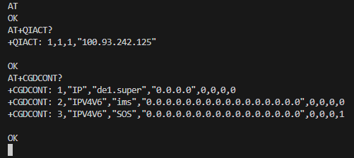
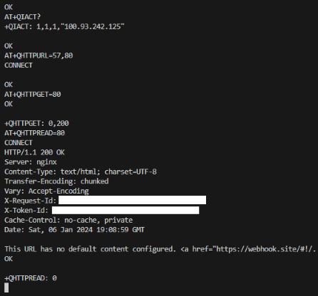
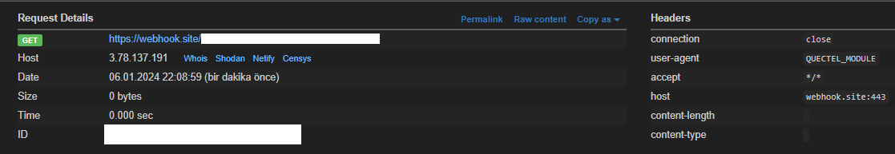
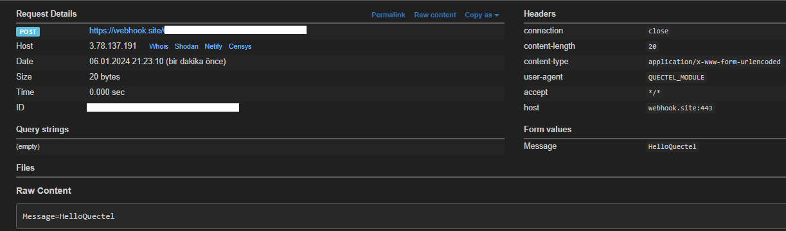
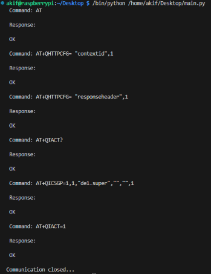
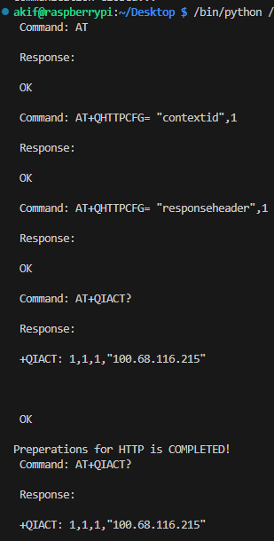
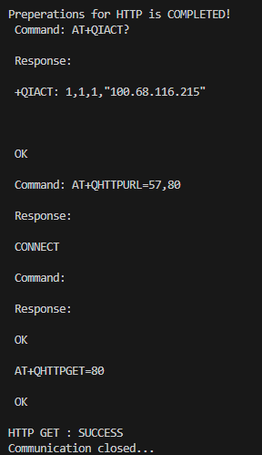
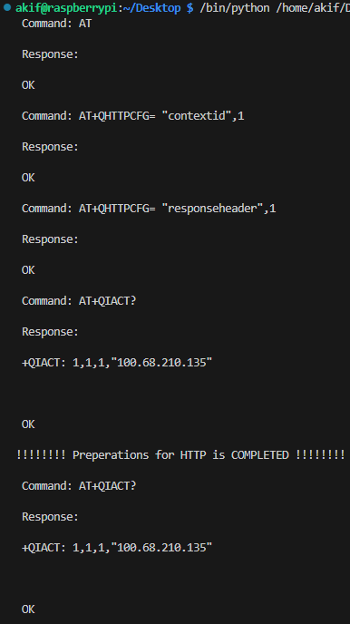
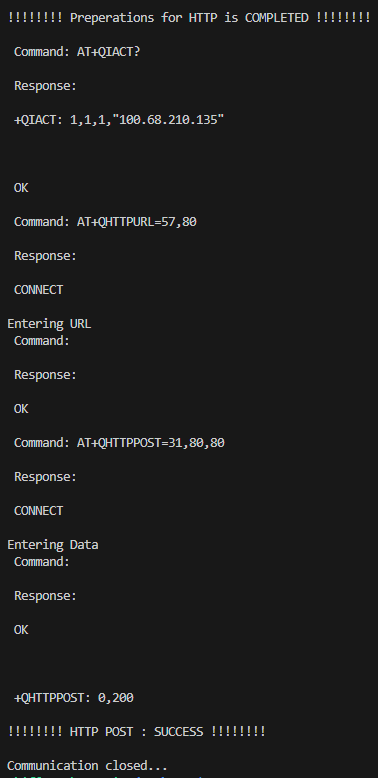

## Week 5 

### Testing HTTP AT Commands on MINICOM

* Last week I had an error in setting the APN and executing the `AT+QIACT=1` command. At the weekly meeting I found out that my error was because I entered the wrong APN name while setting the APN with `AT+QICSGP`. I solved my problem with this command `AT+QICSGP=1,1, "de1.super",""",""",1` and got a **OK** return from the `AT+QIACT=1` command. 
* Now that I have provided my connection with the `AT+QIACT=1` command, I checked the ip address with the `AT+QIACT?` command. Also, I saw my connections with the `AT+CGDCONT?` command. I finished my connection checks by seeing the APN value named **de1.super** in these values.
  
    
*  Now that my connection is done, I started to try the HTTP GET method in my minicom. 
* First of all, I found the byte length of the url link I will send. After I got the length, I ran the `AT+QHTTPURL={url_length},80` command. After this command ran, it gave **CONNECT** output. After seeing this output, I entered the url link here and got **OK** output. I made an HTTP GET request by running `AT+QHTTPGET=80`. I got `+QHTTPGET: 0,200` as output and this means that my GET request went successfully. I read the successful request with the command `AT+QHTTPREAD=80`. 
  
    
*  I checked whether the successful HTTP GET request came on webhook.site.
  
    
*  After successfully completing the HTTP GET request, I started sending the HTTP POST request. I noticed that the POST method is mostly similar to the GET method. Again, I sent the url link whose length I obtained beforehand with the `AT+QHTTPURL={url_length},80` command. After receiving the **OK** return, I started the POST method with the `AT+QHTTPPOST={data_length},80,80` command. After this process, the **CONNECT** output came and I sent the data I would enter after this output. **"Message=HelloQuectel "**. Finally I got `+QHTTPPOST: 0,200` and **OK** which means that the POST method worked successfully. After it went successfully, I took control over the webhook.site.
   
    

### Integration of HTTP GET and POST Requests into the Developed Library

* After successfully testing HTTP requests on minicom, I started to integrate it into the library I am developing. 
* First, I made an update so that I can access the entire response when I send a command. This update is updated in the `get_at_command()` function. In order to access the response, I first split the response by line breaks, so that even if the response contains more than one line, I can access all of them. The second to last value in the split array gives me the return value of the response (OK, ERROR, CONNECT, etc.). The `get_at_command()` function returns this value. 
* Since this connection is common for both HTTP GET and HTTP POST, I created a function called `prep_for_HTTP()` and added this function to the first line of the functions I will set for get and post. This makes the code more readable. 
* The `prep_for_HTTP()` function holds the commands required for the connection in an array and processes them in order. In this function, instead of using `get_at_command()` for the response from the commands, I accessed the data myself, because when there is more than one response and I want to access the one I want, this function only gives me the last response. I did this because the `AT+QIACT=1` command throws an error if a connection has already been established. If a connection has already been established, I added a decision mechanism to avoid repetition of these commands and unnecessary errors. This decision mechanism indicates to the screen that the connection has been successfully established if the first answer contains **+QIACT:** and completes the function without reprocessing unnecessary commands.

    
* The `get_data_HTTP()` function first calls the `prep_for_HTTP()` function to create the necessary environment for HTTP commands to run. After this step, it holds the AT commands required for HTTP GET in the array. This function takes url as input and in order to send this url link with AT commands, I first calculated the byte length. I used this calculation in the `AT+QHTTPURL={byte_length},80` command. When calling the commands in order `AT+QHTTPURL={byte_length},80`, **CONNECT** output comes after this command and the url link must be entered after this output. In order to do this, it checks whether the output from the commands is equal to **CONNECT**. In addition, if **ERROR** is output in the incoming responses, the program stops and prints this information on the screen.

    
    
*  The `post_data_HTTP()` function takes data as input and appends the string **"Message="** at the beginning of this data. This is important for sending the message. After this operation, the length of the message is calculated. In the post method `AT+QHTTPURL={byte_length},80`, `AT+QHTTPPOST={data_length},80` gives **CONNECT** output after these commands. One is for entering url and one is for entering data. To distinguish them, I sent the url for **URL** in the commands I sent, I sent the data for **POST**. These are the two commands I mentioned. When the whole connection goes correctly, it prints the output that it was successful.

    
    